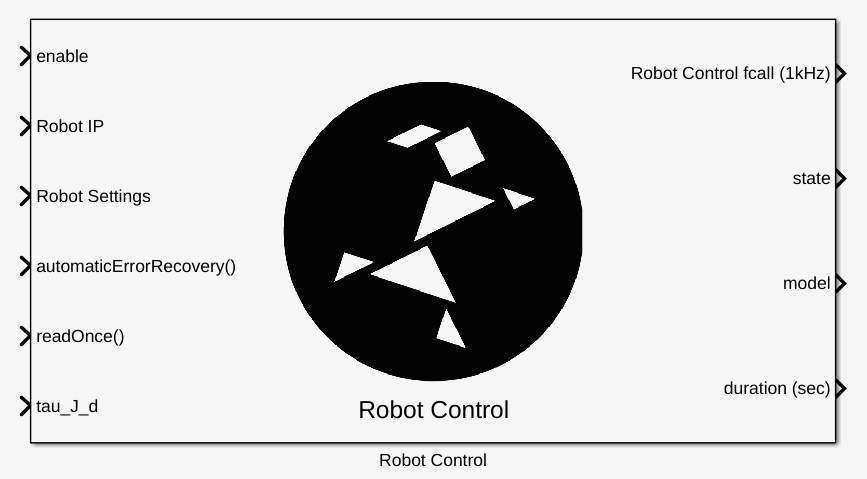

Franka Toolbox for MATLAB
=========================

The Franka Toolbox for MATLAB provides libraries and tools that integrate Franka robots with the MathWorks® software ecosystem.

.. figure:: _static/hardware_config_options.png
    :align: center
    :figclass: align-center

    Hardware/Software configuration options for the Franka Toolbox for MATLAB.

The toolbox comprises two main components:

* ``Franka Library for Simulink``, a set of Simulink blocks for interfacing the Franka Robot.

    The main Robot Control Simulink Block.

* ``Franka Library for MATLAB``, which provides the `FrankaRobot()` MATLAB class for a high-level interface to the Franka Robot.

.. figure:: _static/matlab_pick_and_place_with_RRT_demo.png
    :align: center
    :figclass: align-center

    Example of a pick-and-place operation using RRT and min-jerk optimal trajectory generation in MATLAB Live Script.

.. toctree::
   :maxdepth: 2
   :caption: Contents:

   compatibility
   system_requirements
   installation
   getting_started
   simulink_library
   matlab_library
   troubleshooting
   custom_build
