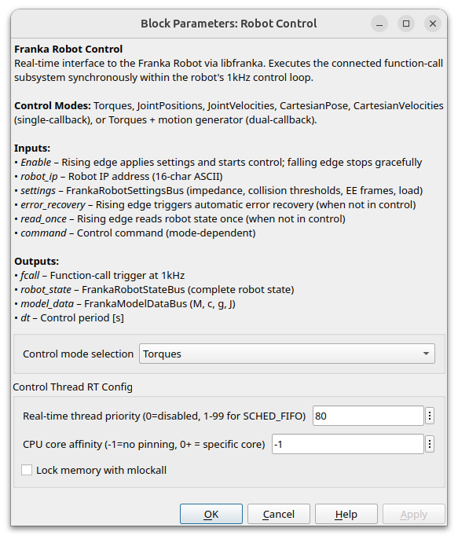

Fanka Library for Simulink - Reference
======================================

.. hint::
    Regarding the input/output signal nomenclature, datatypes, and sizes, the libfranka definitions
    have been fully adopted. You can find the complete list of signals
    `here <https://frankarobotics.github.io/libfranka/0.16.1/structfranka_1_1RobotState.html>`_.
    The column-major format for signals has been adopted as well.

Robot Control
-------------

.. figure:: _static/robot_control_simulink_block.png
    :align: center
    :figclass: align-center

    Robot Control Simulink Block.

This is the main block of the Franka Simulink Library. It is responsible for applying the desired robot parameters and control signals to the robot.

The robot settings can be applied through the block parameters.

    Robot Control Simulink Block Settings.

.. hint::
    If desired, an initial robot configuration can be applied **before** the main execution of the control loop.
    Namely, the robot will move to the desired configuration and only then the main execution of the Simulink model
    will take place. You can define that in the `Initial Configuration` section of the block settings.

Gripper State
-------------

.. figure:: _static/gripper_state.png
    :align: center
    :figclass: align-center

    Get current gripper state Simulink Block.

The gripper state block will inform the application about the current gripper state.

Vacuum Gripper State
--------------------

.. figure:: _static/vacuum_gripper_state.png
    :align: center
    :figclass: align-center
    :width: 300px

    Get current vacuum gripper state Simulink Block.

The vacuum gripper state block will inform the application about the current vacuum gripper state. 

Mass Matrix
-----------

.. figure:: _static/mass_matrix.png
    :align: center
    :figclass: align-center

    Get the Mass Matrix of the Robot Model.

Coriolis
--------

.. figure:: _static/coriolis.png
    :align: center
    :figclass: align-center

    Get the Coriolis Matrix of the Robot Model.

Gravity
-------

.. figure:: _static/gravity.png
    :align: center
    :figclass: align-center

    Get the Gravity Vector of the Robot Model.

Jacobian
--------

.. figure:: _static/jacobian.png
    :align: center
    :figclass: align-center

    Get the Jabobian Matrix of the Robot.

You can select between "zero" or "body" Jacobian as well as the desired
frame inside the block parameters.

Pose
----

.. figure:: _static/pose.png
    :align: center
    :figclass: align-center

    Get the Robot Pose.

You can select the desired pose frame inside the block parameters.
